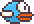

<!-- PROJECT LOGO -->
<br />
<p align="center">
  <a href="https://github.com/DannySauval/Flappy_Bird_AI">
    
  </a>

  <h3 align="center">Flappy Bird AI</h3>

  <p align="center">
    Flappy Bird game to play around with ANN
    <br />
    <a href="https://github.com/DannySauval/Flappy_Bird_AI"><strong>Explore the docs »</strong></a>
    <br />
    <br />
    <a href="https://www.youtube.com/watch?v=k5eCCTYA3vc">View Demo on YouTube</a>
    ·
    <a href="https://github.com/DannySauval/Flappy_Bird_AI/issues">Report Bug</a>
    ·
    <a href="https://github.com/DannySauval/Flappy_Bird_AI/issues">Request Feature</a>
  </p>
</p>


<!-- TABLE OF CONTENTS -->
<details open="open">
  <summary><h2 style="display: inline-block">Table of Contents</h2></summary>
  <ol>
    <li>
      <a href="#about-the-project">About The Project</a>
    </li>
    <li>
      <a href="#getting-started">Getting Started</a>
      <ul>
        <li><a href="#prerequisites">Prerequisites</a></li>
        <li><a href="#installation">Installation</a></li>
      </ul>
    </li>
    <li><a href="#usage">Usage</a></li>
    <li><a href="#contact">Contact</a></li>
    <li><a href="#acknowledgements">Acknowledgements</a></li>
  </ol>
</details>


<!-- ABOUT THE PROJECT -->
## About The Project

I wanted to make a simple game using what I learned about AI lastly. The idea was to be as simple as possible, AND start from scratch. I forbid myself to use anything other than numpy and pygame or standard libraries.

I decided to go with Flappy Bird which is a simple game to implement and play (except for me, I'm bad at it). Only a few data are required for the bird to play, and the output decision is simple, either you jump or you don't.

The AI behind this project is a simple neural network (just one hidden layer). The learning process uses part of a genetic algorithm, I take the best bird and I tweak its genes to generate a new generation.


<!-- GETTING STARTED -->
## Getting Started

To get a local copy up and running follow these simple steps.

### Prerequisites

There are a few requirements to be able to run Flappy Bird AI.
* Python 3.x : <a hfref="https://www.python.org/downloads/">https://www.python.org/downloads/</a>
* pygame 
  ```sh
  pip install pygame
  ```
* numpy (at the time of writing, there is a bug about some checks in the latest version of numpy, 1.19.4)
  ```sh
  pip install numpy==1.19.3
  ```

### Installation

1. Clone the repo
   ```sh
   git clone https://github.com/DannySauval/Flappy_Bird_AI.git
   ```
2. Run FlappyBird.py
   ```sh
   py.exe FlappyBird.py
   ```

<!-- USAGE EXAMPLES -->
## Usage

I wrote the code keeping in mind I wanted to be able to tweak parameters and see what it does on the final result. In my opinion, it is the best way to learn. 
You can change most of the settings in the `settings.py` file and see what it does, like the number of birds for each generation. Regarding the mutation specific settings, it is not using parameters from the settings file yet, maybe it will in a future version. But if you want to tweak them, you should check the `model_mutate()` method.

I hope everything is clear enough and that this project will help you. If you have any question or suggestion, feel free to contact me !


<!-- CONTACT -->
## Contact

Danny SAUVAL 
- Twitter : [@DSauval](https://twitter.com/DSauval)
- Youtube : [DannySauval](https://www.youtube.com/channel/UC_pCdmt0cSF49st1b5q6yIQ)
- Email : sauvaldanny@gmail.com

Project Link: [https://github.com/DannySauval/Flappy_Bird_AI](https://github.com/DannySauval/Flappy_Bird_AI)

<!-- ACKNOWLEDGEMENTS -->
## Acknowledgements

* [Clear code](https://www.youtube.com/watch?v=UZg49z76cLw) The Flappy Bird game mechanics come from him. I designed my Flappy Bird quicker and better thanks to his video. Thanks !
* Internet !
